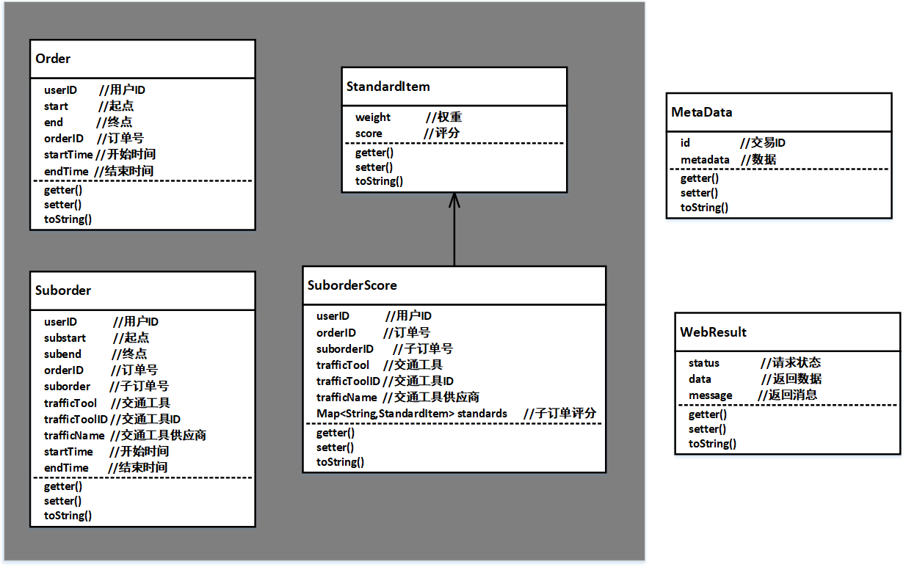
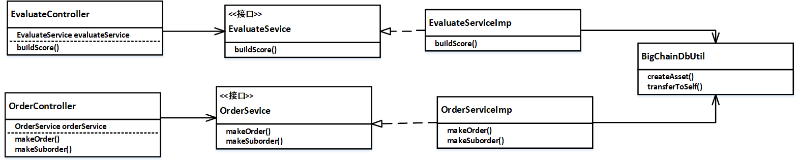

# 项目说明
spring boot 项目
## 1.准备环境
- java 8
- bigchaindb 

## 2 流程

### 2.1 启动
项目启动后会自动连接配置文件` application.properties`中 `BigchainDB_URL`的BigchainDB，所以需要在启动此项目前将BigchainDB节点启动。

### 2.2 API
#### 1. 创建订单 `/makeOrder`
http请求：
- 请求中的`key`表示: 用户的密钥字符串，登录和注册没有做好，先这样用
- 返回值中的 `data` 表示 该订单的资产ID
- 
```
POST http://127.0.0.1:8080makeOrder?key=MC4CAQAwBQYDK2VwBCIEIDRcSHGUffy8RC0nezN4IvU88HgSmoHYBMxc6Wlpj11T
data:
{	
    "userID":"144",
    "start":"物资学院路",
    "end":"香山公园",
    "orderID":"1",
    "startTime":"2018-08-02 20:05:55",
    "endTime":"2018-08-02 22:05:55"
}

response：
{
    "status": 0,
    "data": "bf03cf174f0bbaa3d573a79e01f03157d5cf5b623a5db11ea284ad7f48e487ef",
    "message": "Order build success"
}
```
#### 2. 创建子订单 `/makeSuborder`
- 请求中的`key`表示: 用户的密钥字符串，登录和注册没有做好，先这样用
- 返回值中的 `data` 表示 该子订单的交易ID

```
POST 127.0.0.1:8080/makeSuborder?key=MC4CAQAwBQYDK2VwBCIEIDRcSHGUffy8RC0nezN4IvU88HgSmoHYBMxc6Wlpj11T
data：
{
    "suborderID":"1",
    "orderID":"1", 
    "userID":"144", 
    "subStart":"物资学院路",
    "subEnd":"海淀五路居",
    "trafficTool":"bus",  
    "trafficToolID":"1",      
    "trafficName":"北京公交",
    "subStartTime":"2018-08-02 20:05:55",
    "subEndTime":"2018-08-02 20:05:55"
}

response：
{
    "status": 0,
    "data": "fd743f71579b0f36e6cd9b8b6aa66caf6e8aa5a1b7aa24669530dbfedf498b69",
    "message": "suborder build success"
}
```

#### 3. 创建子订单评价 `/score`
- 请求中的`key`表示: 用户的密钥字符串，登录和注册没有做好，先这样用
- 返回值中的 `data` 表示 该子订单评价的交易ID
```
POST http://127.0.0.1:8080/score?key=MC4CAQAwBQYDK2VwBCIEIDRcSHGUffy8RC0nezN4IvU88HgSmoHYBMxc6Wlpj11T
data：
{
    "trafficTool":"bus",
	"trafficToolID":"1",
	"trafficName":"北京公交",
    "suborderID":"1", 
    "userID":"144",
    "orderID":"1",
    "standards":{
    	"waitTime":{ 
    		"weight":"20",
    		"score":"10"
    	},
    	"convenientLevel":{ 
    		"weight":"20",
    		"score":"10"
    	},
    	"serviceLevel":{ 
    		"weight":"20",
    		"score":"10"
    	},
    	"travelInfoSevice":{ 
    		"weight":"20",
    		"score":"10"
    	},
    	"comfortableLevel":{ 
    		"weight":"20",
    		"score":"10"
    	},
    	"Cleanliness":{ 
    		"weight":"20",
    		"score":"10"
    	}
    }
}

response：
{
    "status": 0,
    "data": "fd743f71579b0f36e6cd9b8b6aa66caf6e8aa5a1b7aa24669530dbfedf498b69",
    "message": "add suborder score  success"
}
```

### 2.3 类图
#### 1 POJO文件夹 
此文件夹中的类，大多数是和数据库表对应，包含getter和setter方法
- `Order`:订单对象
- `Suborder`:子订单对象
- `StandardItem`: 评价标准项对象
- `SuborderScore`：子订单评价对象，其中`standard`是Map结构，key是评价指标的名称，value是`StandardItem`



#### 2 类图


